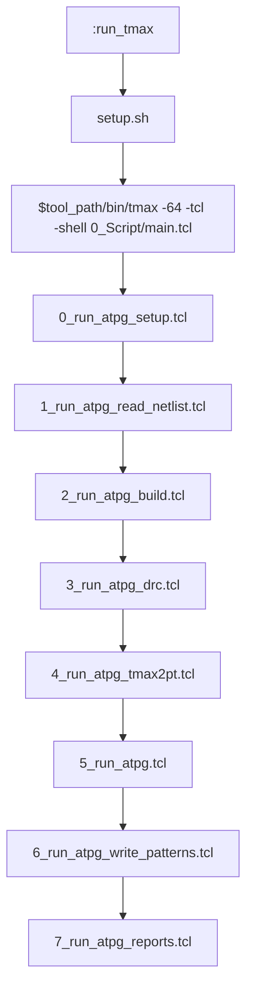
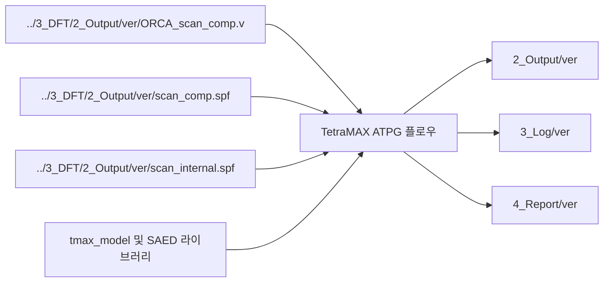
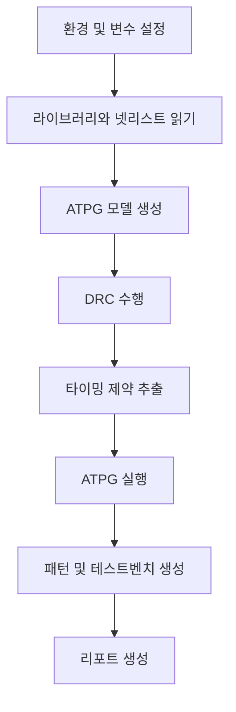
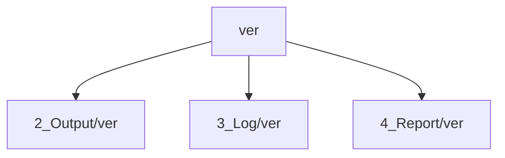

# 4_ATPG 플로우 다이어그램

## 1. 상위 실행 흐름

## 2. 입력과 출력 연결

## 3. 단계별 책임

## 4. 버전 기반 데이터 분리

## 5. 해석 메모

1. 셸 래퍼는 실행 버전과 상위 입력 선택을 제어한다.
2. `0_Script/` 아래의 모듈형 TCL 플로우가 현재 기준 구현이다.
3. ATPG 작업 공간은 외부 DFT 산출물과 공정 라이브러리에 의존한다.
4. 출력, 로그, 리포트는 모두 `ver` 값으로 분리된다.
5. `3_Log/${ver}`만 있고 `2_Output/${ver}`, `4_Report/${ver}`가 비어 있으면 패턴 생성 또는 리포트 생성 전에 중단됐을 가능성이 높다.